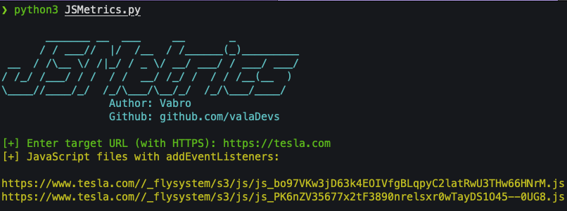

## JSHUNTER
- find EventListeners in JavaScript files easily ;)

### How to Use ?
- first clone the repository  
```bash
    git clone https://github.com/valaDevs/JSMetrics.git
```

- then change direcotory
```bash
cd JSMetrics
```

- now install packages
```bash
pip install -r requirements.txt
```

- and it's time to hack !
```bash
python3 JSMetrics.py
```

